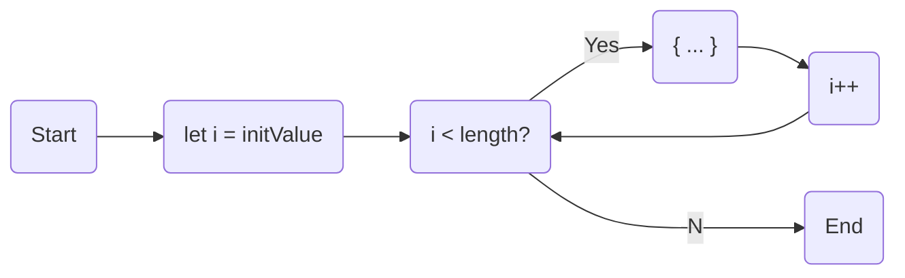

# Loops

We use loops to repeat the execution of a code block. The repetition times can be zero, a finite number, or infinity.

## for loop

The basic form of the `for` loop is

```js
for(let i = initValue; i < length; i++) {
    // TODO: ...
}
```

where:

- `let i = initValue`: the initialization part to initialize the counter variable.
- `i < length`: the condition for the repetition (i.e., compare the counter and its limit)
- `i++`: an increment or a decrement (of the counter after executing the code block)

and its execution flow



### Examples

#### Print from 0 to 9

```js
for (let i = 0; i < 10; i++)
    console.log(i)
```

#### Print from 9 to 0

```js
for (let i = 9; i > -1; i--)
    console.log(i)
```