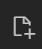

[Home](../README.md#preliminaries) > [Premilinaries](../README.md#preliminaries) > Visual Studio Code IDE

# Visual Studio Code IDE

## Installation

Go to [Visual Studio Code homepage](https://code.visualstudio.com/), and download an appropriate installer.

[[Back to Preliminaries]](../README.md#preliminaries)

## Start coding

1. Press `Ctrl + Shift + E` to active `Explorer`.
2. Click `Open Folder` and select the directory (i.e., folder) you want to store your source files.
3. On the `Explorer` panel, click the new file icon , fill the file name, for example, `sample.js`, and then press `Enter`. 

Visual Studio Code will open the file to the main editor region, and you can start your coding.

*To open the `Terminal`, press `Ctrl + J`.*

[[Back to Preliminaries]](../README.md#preliminaries)

## Searching

### Find files by a particular name

`Ctrl + P`

### Find a content in the current project

`Ctrl + Shift + F`

## Node.js debugging

1. Press `Ctrl + Shift + P` to show all support commands
2. Choose `Debug: Toggle Auto Attach`
3. Choose `Only With Flag`
4. Type `exit` in the current Terminal if opening.
5. Press `Ctrl + J` to start a new Terminal session
6. To start debugging a script, type `node --inspect script_path`