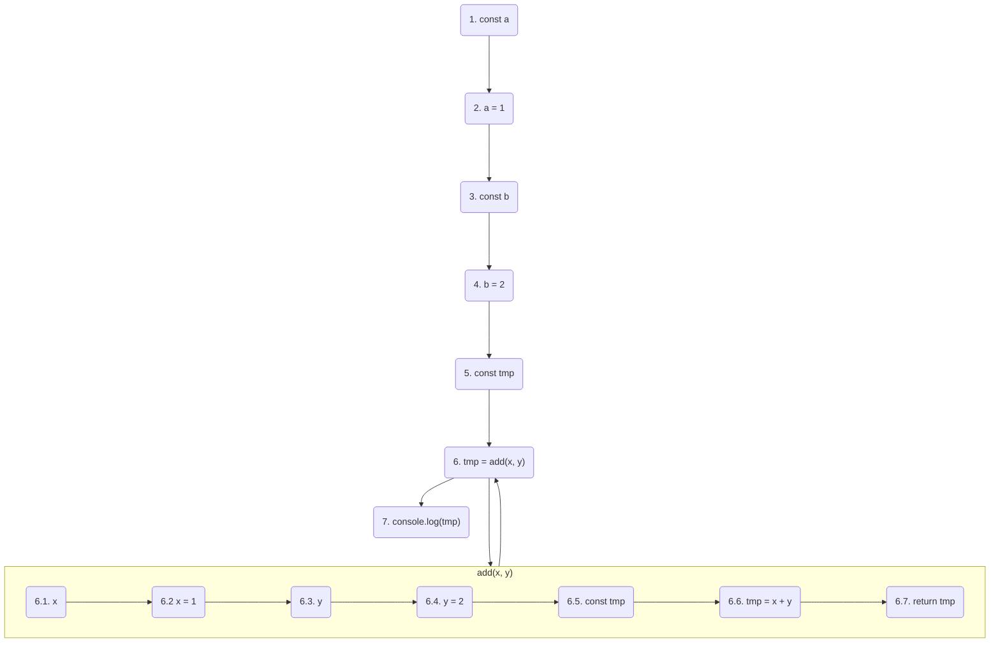

# Running flow

Understanding how our codes run is essential. In this section, I will give some examples to help you to get the basic concept of the running flow of a script. 

## A standalone script

*[sample-run.js](samples/sample-flow-01.js)*

```js
const a = 1,
  b = 2

function add(x, y) {
  return x + y
}

console.log(add(a, b))

// output: 3
```

*Terminal*

```sh
node script01
```

*Abstract execution flow*

