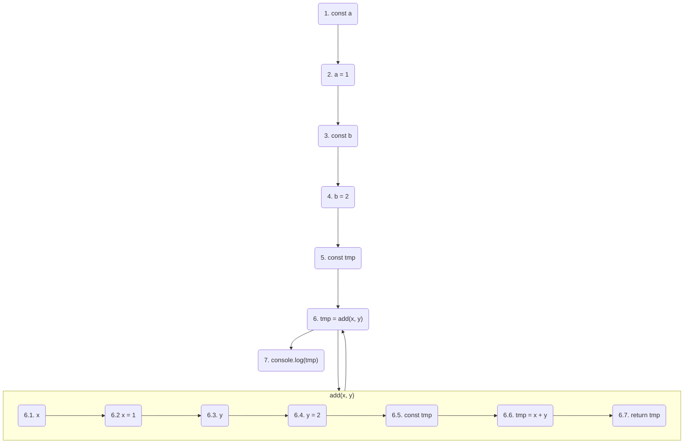

# Running Scripts

In Terminal, type the following command

`node <script_path>`

- `script_path`: the path of the script (i.e., a `.js` file)

## Running flow

### A standalone script

*script01.js*

```js
const a = 1,
    b = 2

function add(x, y) {
    return x + y
}

console.log(add(a, b))
```

*Terminal*

```sh
node script01
```

*Abstract execution flow*




